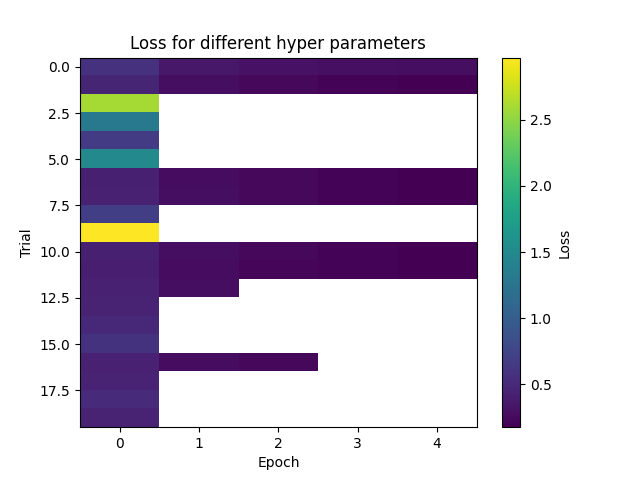
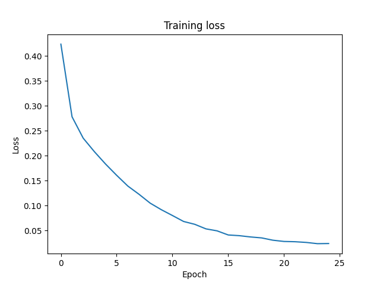
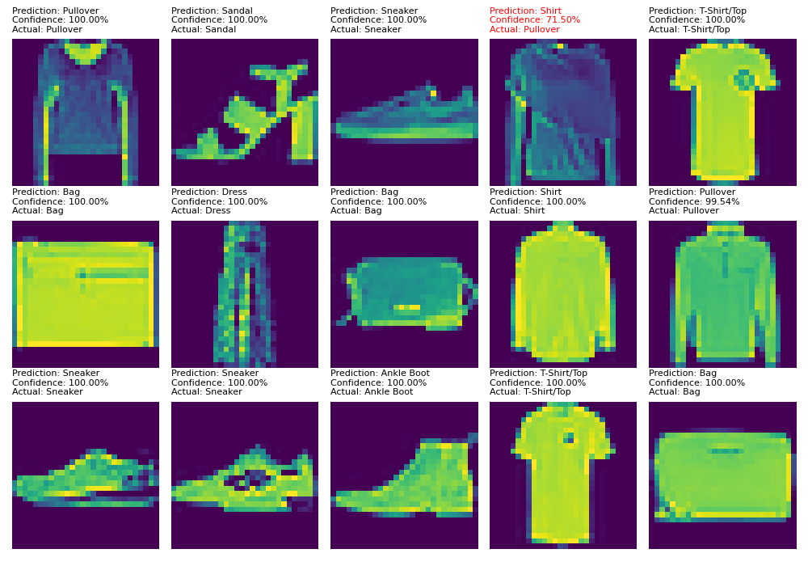

# Fashion Classifier
A DeepLearning model developed using PyTorch for classifying images from the [Fashion MNIST](https://github.com/zalandoresearch/fashion-mnist) data set.
This is my first time using PyTorch and intended to teach me some basic concepts of it.

## Performance 📊
I tuned the hyper-parameters for 20 trials with 5 epochs each and then trained the model for 25 epochs.
This resulted in an accuracy of 93.19% for unseen test data.
   
The following graph shows a sample of the test data along with the models predictions.

As you can see, the model is pretty confident for all predictions that it got correct, but also relatively confident for the one 
prediction that it got wrong, which I assume is due to the similarity of Shirts and Pullovers.

## Installation 💻
### Option 1 with Docker 🐳 (Recommended)
Since I have not deployed the Docker image for this project to Docker Hub, you need to create the image yourself.
1. Clone the repo:  
`git clone git@github.com:qhilipp/FashionClassifier.git`
2. cd into the repo:  
`cd FashionClassifier`
3. Create the docker image:  
`docker build -t fashion-classifier:latest .`
4. Run the image:   
`docker run --name fashion-classifier-container -v $(pwd):/app fashion-classifier:latest python3.13 main.py --load model`

### Option 2 without Docker 🐳❌
Make sure you have Python 3.13 installed and the 'python' command pointing to version 3.13.
1. Clone the repo:  
`git clone git@github.com:qhilipp/FashionClassifier.git`
2. cd into the repo:  
`cd FashionClassifier`
3. Create a virtual environment  
`python -m venv env` or with Conda `conda -n fashion-classifier python=3.13`
4. Activate it  
`source evn/bin/activate` or with Conda `conda activate`
5. Install the packages  
`pip install -r requirements.txt`
6. Run  
`python main.py --load model`

## Arguments 🚀
| Argument                    | Shortform | Type | Description                                                                                             | Default Value |
|-----------------------------|-----------|------|---------------------------------------------------------------------------------------------------------|---------------|
| `--load`                    | `-l`      | str  | The name of the file from which the model should be loaded.                                             | `None`        |
| `--save`                    | `-s`      | str  | The name of the file to which the model should be saved.                                                | `None`        |
| `--device`                  | `-d`      | str  | The device on which PyTorch should perform the tensor calculations (`cpu` or `cuda`, if available).     | `'cpu'`       |
| `--epochs`                  | `-e`      | int  | The number of epochs used to train the model.                                                           | `20`          |
| `--trials`                  | `-t`      | int  | The number of trials to find optimal hyperparameters.                                                   | `5`           |
| `--trial_epochs`            | `-te`     | int  | The number of epochs per trial when finding optimal hyperparameters.                                    | `2`           |
| `--load_hyper_parameters`   | `-lh`     | str  | The name of a JSON file from which the model should load its hyperparameters.                           | `None`        |
| `--save_hyper_parameters`   | `-sh`     | str  | The name of a JSON file to which the model should save its hyperparameters.                             | `None`        |

